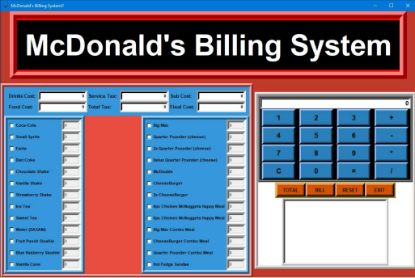
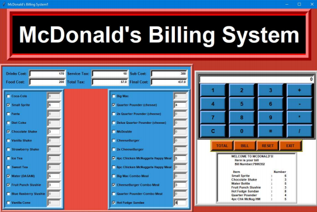

# McDonald-s-Billing-System

## Why is the system needed?
The benefits of an effective management system to an organisation include:
1. More efficient use of resources and improved financial performance.
2. Improved risk management.
3. Protection of people and the environment.    

A successful business depends on many processes that work in sync with each other. **McDonalds Management System** is designed with features to help manage and operate different aspects of their restaurants more efficiently and more profitably. 

## What does the management system do?
The management system displays the menu of McDonalds, the customer selects the items and the number of items required. The management system then returns a sample bill, including taxes paid, and the costs given for several items. If the customer needs to confirm again the calculation made by the application, the application comes with a small calculator.

## THE FINAL LAYOUT OF THE APPLICATION

## Going A  Little Inside the System

#### Buttons used in the System
  1. Exit Button – Opens a prompt to confirm whether user wants to exit or not. 
  2. Reset Button – This button resets all the values in the menu and in the bill layout to
  initial value. 
  3. Bill Button – Generates the Bill using simple text insert function to insert the
  values at the right place. 
  4. Total Button – Total button is used to calculate the various cost.

#### Various cost labels used in the System
1. Cost of Drinks
2. Cost of Food
3. Service Tax
4. Total Tax
5. Sub Cost
6. Total Cost 

## Sample Output of the System

